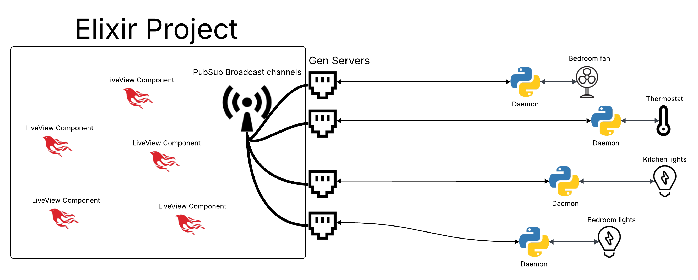

<h1 style="border-bottom: none; margin-bottom: 0;">Argus Smart Home Platform</h1><br />

This project is a Phoenix LiveView web application for managing smart home environments through a hierarchy of **Homes**, **Spaces**, and **Appliances**. The term “Space” was chosen over "Room" due to the possibility of ambiguous divisions, such as with living rooms, kitchens, and dining rooms. This nomenclature also allows for inclusivity of outdoor areas like yards, decks, etc.

Appliances can either belong to a space or directly to a home (like with AC). The system is built to be compatible with nearly any wireless device, even closed-source devices, allowing a high level of control and customizability.

---

<h2 style="border-bottom: none; margin-bottom: 0;">🌐 Website Structure</h2>

The site operates in a clear hierarchical path structure using slugs:

- `/homes` – Displays all homes.
- `/homes/:home_slug` – Entry point to view a single home.
- `/homes/:home_slug/:space_slug` – Displays a specific space within a home, showing all appliances.
- Appliances render as LiveComponents dynamically based on their command capabilities, allowing for instant feedback when a device updates its state.

Navigation is done via LiveView, with seamless transitions between states and live rendering of device controls.

---

<h2 style="border-bottom: none; margin-bottom: 0;">🗃️ Database & Domain Structure</h2>

### Core Tables:

#### 1. `homes`

- `id`
- `name`
- `address`
- `slug`

#### 2. `spaces`

- `id`
- `name`
- `slug`
- `home_id` (FK)

#### 3. `appliances`

- `id`
- `name`
- `slug`
- `mac_address`
- `space_id` (FK)
- `home_id` (FK)

#### 4. `appliance_commands`

- `id`
- `commnand_type` which can be either `read`, `write`, or `lifecycle`
- `name` (e.g., `on`, `off`, `volume`)
- `protocol` (e.g., `bluetooth`, `zigbee`)
- `uuid`
- `command` (a static binary or dynamic JSON pipeline)
- `appliance_id` (FK)

---

<h2 style="border-bottom: none; margin-bottom: 0;">⚙️ Dynamic Command Pipelines</h2>

For complex device controls that require user input (like volume), static commands are not enough. Different devices may differ wildly from one another in how they communicate commands, and it is not feasible to hardcode every instance. To solve this, Argus stores commands as **pipelines** in JSON format:

### Example:

```json
[
  ["max", 1],
  ["min", 100],
  ["add", 1],
  ["hex"],
  ["prepend", 1],
  ["bytearr"]
]
```

Where the first element represents the function that is called, with the user input (or the result of the last pipe) as the first parameter, and the second element onwards are additional parameters. This then compiles with user input and transforms input into a sendable command signal.

### Interpreter:

Defined in `Argus.CommandPipeline`, the system maps function names to actual Elixir logic:

```elixir
%{
  "min" => fn [a, b] -> min(a, b) end,
  "max" => fn [a, b] -> max(a, b) end,
  "add" => fn [a, b] -> a + b end,
  "hex" => fn [a] -> Integer.to_string(a, 16) end,
  "bytearr" => fn [list] -> :erlang.list_to_binary(list) end,
   ...
}
```

This design allows for easy changes to the function bank, and ease of extensibility into eventually automating the process of pipeline creation for a device command.

---

<h2 style="border-bottom: none; margin-bottom: 0;">🔌 Device Communication System</h2>

- Devices are controlled using a long-running Python subprocess (called `DeviceDaemon`) started and connected by a `DeviceWorker` GenServer.
- A GenServer and Python subprocess for each appliance is opened on startup to maintain a persistent connection with the device
- On initialization, each daemon receives the MAC address of the device it is assigned to, along with any handshakes or other protocols required to connect
- The daemon listens for any messages sent from the GenServer to forward to the device. Responses from the device are processed by the daemon and sent back to the GenServer to be handled

---

<h2 style="border-bottom: none; margin-bottom: 0;">🔁 PubSub State Sync</h2>

- Once the GenServer receives a response from the device daemon, it broadcasts that response to the rest of the Elixir project using PubSub. Each device has its own broadcast station
- LiveComponents on the web app subscribe to relevant stations and rerender in real time when devices change state, even if triggered externally (e.g., manually pressing the button on the appliance)
- When a control is interacted with on the LiveView, a command message is sent through PubSub and back to the GenServer with the appropriate data
<br /><br /><br />



---

<h2 style="border-bottom: none; margin-bottom: 0;">🧩 LiveViews And Components</h2>

### `ArgusWeb.HomeLive`

Renders a given home and loops over all spaces, and any appliances that belong directly to the home, rendering a LiveComponent for each appliance

### `ArgusWeb.SpaceLive`

Renders a given space and loops over all appliances within it, rendering a LiveComponent for each appliance

### `ArgusWeb.ApplianceLive`

Renders controls and other interfaces based on available commands. Detects if `on`, `off`, or `volume` commands exist and renders the appropriate control.

---

<h2 style="border-bottom: none; margin-bottom: 0;">📌 Highlights</h2>

- Fully dynamic signal generation via JSON pipelines
- LiveView components rendered conditionally based on device capabilities
- Persistent GenServer + Python port architecture for device communication
- Real-time UI state sync using Phoenix PubSub
- Expandable control structure for future appliance types
<br /><br />
---